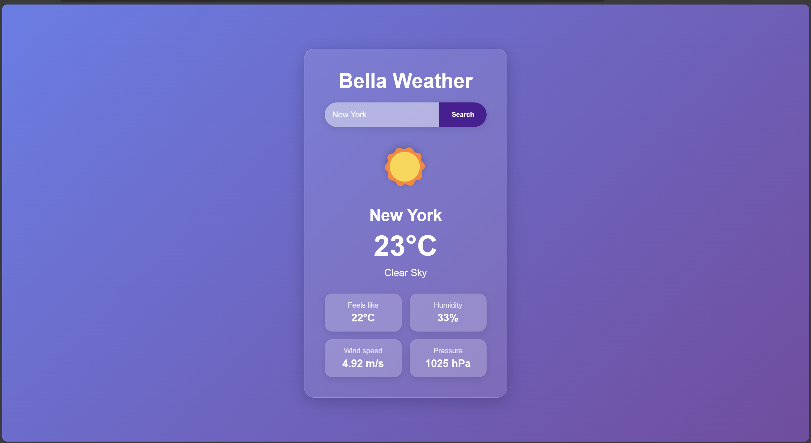

Bella Weather App

Introduction

The Bella Weather App is a stylish and modern web application that provides real-time weather information for any city around the world. Designed with a sleek interface and interactive features, this app allows users to check current weather conditions like temperature, humidity, wind speed, and more. With responsive design and beautiful animations, the Bella Weather App delivers both functionality and a visually pleasing user experience.

Live Demo:  https://sahle-1996.github.io/Build-your-portfolio-project--Week-2---MVP-Complete/

Author: Sahle Goitom
LinkedIn: https://www.linkedin.com/in/sahle-goitom-57451b1a2/

Features

Responsive Design: The app works seamlessly across both desktop and mobile devices.
Interactive Weather Icons: Dynamic animations based on the weather conditions for a more engaging experience.
Glassmorphism Effect: Implements a modern frosted-glass appearance for a polished UI.
Search Functionality: Users can search for weather information by city name.
Detailed Weather Information: Displays current temperature, feels-like temperature, weather description, humidity, wind speed, and pressure.
Technologies Used
HTML
CSS
JavaScript
OpenWeatherMap API
Setup and Installation
Clone the repository:
bash
Copy code
git clone https://github.com/yourusername/BellaWeatherApp.git
Open the index.html file in your preferred web browser.
No additional setup is required.

Usage
Enter a City Name: Type the name of the city you want to check the weather for in the search box.
Click "Search": Press the search button or hit "Enter" to retrieve weather information.
View Weather Details: The app will display the current weather conditions, including temperature, humidity, wind speed, and other details.
API Key
This app uses the OpenWeatherMap API. Replace the API_KEY variable in index.html with your own API key from OpenWeatherMap.

javascript
Copy code
const API_KEY = "**********";
Customization
Styling: Customize the appearance by modifying the CSS styles in index.html.
Weather Icons and Animations: Modify the getWeatherIcon and getAnimationClass functions to update icons and animations for different weather conditions.
Contributing
Contributions are welcome! To contribute:

Fork the repository.
Create a new branch (git checkout -b feature-branch).
Make and commit your changes (git commit -m 'Add some feature').
Push to the branch (git push origin feature-branch).
Open a pull request.
Related Projects
Another Weather App https://weather.com/
Explore similar projects that might inspire further improvements.
License
This project is licensed under the MIT License. See the LICENSE file for more details or click here to view the full license.

Contact
For any questions or feedback, feel free to reach out:
Email: alxforalx@gmail.com
LinkedIn: Sahle Goitom's [LinkedIn](https://www.linkedin.com/in/sahle-goitom-57451b1a2/)

